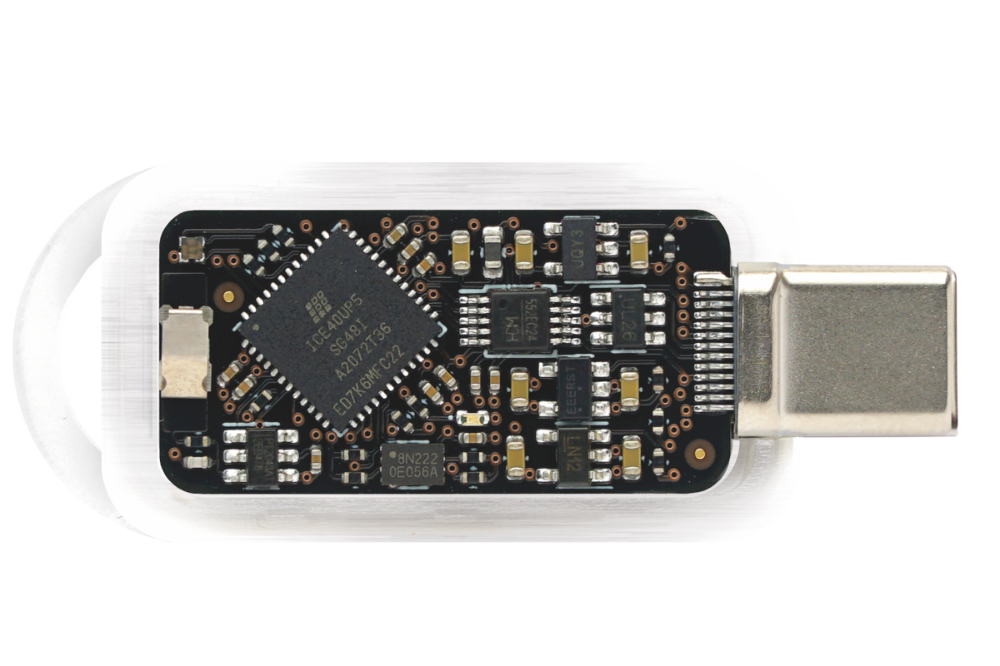

[](https://github.com/tillitis/tillitis-key1/actions/workflows/ci.yaml)

# Tillitis TKey

Read about current work in progress
[here](#current-work-in-progress-in-this-repository).

 *The TK1 PCB, also known as
TKey.*

## Introduction

The Tillitis TKey is an open source, open hardware FPGA-based USB
security token using
[DICE-like](https://trustedcomputinggroup.org/work-groups/dice-architectures/)
unconditional measured boot that can run generic applications while
still guaranteeing the security of its cryptographic assets.

[TKey Threat Model](doc/threat_model/threat_model.md).

With the right application, the TKey can be used for:

- authentication,
- cryptographic signing,
- encryption,
- root of trust,
- and more: it's a general computer!

If you want to know more about Tillitis and the TKey, visit:

- Main web: <https://tillitis.se/>
- Shop: <https://shop.tillitis.se/>
- Developer Handbook: <https://dev.tillitis.se/>
- Officially supported apps: <https://tillitis.se/download/>
- Other known apps: <https://dev.tillitis.se/projects/>

All of the TKey software, firmware, FPGA Verilog code, schematics and
PCB design files are open source, just like all trustworthy security
software and hardware should be.

## Licensing

Unless otherwise noted, the project sources are copyright Tillitis AB,
but you can redistribute it and/or modify it under the terms of the
BSD-2-Clause license.

Until Oct 29, 2025, the license was GPL-2.0 Only.

Each imported project is typically kept in its own directory with its
own LICENSE file.

### SPDX

The project uses single-line references to Unique License Identifiers
as defined by the Linux Foundation's [SPDX project](https://spdx.org/).
The line in each individual source file identifies the license
applicable to that file.

The current set of valid, predefined SPDX identifiers can be found on
the SPDX License List at:

https://spdx.org/licenses/

We attempt to follow the [REUSE
specification](https://reuse.software/).

### Notable imported projects

- ch552 firmware: `hw/usb_interface/ch552_fw/`

  Originally by WCH under MIT. Much changed by Tillitis.

- picorv32: `hw/application_fpga/core/picorv32`

  From https://github.com/YosysHQ/picorv32

  ISC.

- PicoRV32 custom ops: `hw/application_fpga/fw/tk1/picorv32/`

  CC-1.

- tkey-libs: `hw/application_fpga/tkey-libs/`

  BSD2. From https://github.com/tillitis/tkey-libs

## Repositories

This repository contains the FPGA design, the source of the
firmware/bootloader, and the source of the USB controller firmware.

Specific documentation regarding implementation is kept close to the
code/design in README files, typically in the same directory.

Note that development is ongoing. To avoid unexpected changes of
derived key material, please use a tagged release. Read the [Release
Notes](doc/release_notes.md) to keep up to date with changes and new
releases.

The TKey PCB [KiCad](https://www.kicad.org/) design files are kept in
a separate repository:

<https://github.com/tillitis/tk1-pcba>

The TP1 (TKey programmer 1) PCB design files and the firmware sources
are kept in:

<https://github.com/tillitis/tp1>

Note that the TP1 is only used for provisioning the FPGA bitstream
into flash or the FPGA configuration memory. It's not necessary if you
just want to develop apps for the TKey.

We use the tkey-libs libraries used for device app development in the
firmware, too:

https://github.com/tillitis/tkey-libs

but keep our own copy of it in the repo. See below.

## Building & flashing

These instructions assume you're using a Linux distribution. Most of
them also assume you're using our OCI image
[tkey-builder](https://ghcr.io/tillitis/tkey-builder). If you want to
run native tools, look in `contrib/Dockerfile` and
`contrib/buildtools.sh` for the tools and versions to use.

### FPGA

You need a [TKey
Unlocked](https://shop.tillitis.se/products/tkey-not-provisioned), a
[the TP1 TKey Programmer
board](https://shop.tillitis.se/products/tkey-dev-kit), and probably a
[Blinkinlabs CH55x Reset
Controller](https://shop-nl.blinkinlabs.com/products/ch55x-reset-controller)
to use this on real hardware.

Building is probably easiest using make and Podman.

To build everything and then flash the resulting bitstream with the
defaultapp in app slot 0 and the partition table copies in one go,
place the TKey Unlocked in the TP1, then do:

```
cd contrib
make flash
```

This uses the make target `prog_flash` in
`hw/application_fpga/Makefile` behind the scenes, but mounts your TP1
device into the container.

If you want to change the default app the TKey uses, change
`FLASH_APP_0` in the `hw/application_fpga/Makefile`.

To see all container targets:

```
cd contrib
make
```

See the [Tillitis Developer Handbook](https://dev.tillitis.se) for
more.

### USB Controller

The TKey uses a WCH CH552 chip as a USB controller. It has its own
firmware.

Build:

```
cd contrib
make run
cd hw/usb_interface/ch552_fw
make
```

To flash the controller with new firmware you need hardware like the
[Blinkinlabs CH55x Reset
Controller](https://shop-nl.blinkinlabs.com/products/ch55x-reset-controller)
and a USB-A to USB-C converter.

[Reset Controller source](https://github.com/Blinkinlabs/ch55x_programmer).

You also need [chprog](https://github.com/ole00/chprog).

The bootloader identifies itself as USB VID 4348, PID 55e0. To be able
to access it and run `chprog` without root you need to allow your user
to access it. Place `contrib/99-tillitis.rules` in `/etc/udev/rules.d`
and run `udevadm control --reload`. Now you can add your user to the
`dialout` group and access it.

1. Connect the Reset Controller to your computer through "DUT\_IN"/"PC".
2. Connect the TKey to "DUT\_OUT"/"DUT".
3. Press the "Bootloader" button.
4. Run `make flash_patched` in `hw/usb_interface/ch552_fw` outside of
   a container.

## Updating and working with tkey-libs

A copy of [tkey-libs](https://github.com/tillitis/tkey-libs) is kept
in `hw/application_fpga/tkey-libs`. This is mostly to avoid the
subtleties of Git submodules.

If you want to change something in tkey-libs, always change in the
upstream library at:

https://github.com/tillitis/tkey-libs

You can build with an out-of-tree copy if you set `LIBDIR`, for
example:

```
make LIBDIR=~/git/tkey-libs firmware.elf
```

When it's time to update the in-tree tkey-lib first tag the upstream
repo with an `fw` prefix, like `fw-1` even if it already has an
official version tag.

Easiest is probably to just remove the tkey-libs directory and then
git clone the desired tag. Use the entire repo, but remove the .-files
like `.git`, `.github`, et cetera. Something like:

```
$ rm -rf tkey-libs
$ git clone git@github.com:tillitis/tkey-libs.git
$ cd tkey-libs
$ git checkout fw-3
```

Note that you need to change the optimization flag in the tkey-libs'
Makefile to `-Os`.

## Measured boot

The key behind guaranteeing security even as a general computer is the
unconditional measured boot. This means that we have a small,
unchangeable, trusted firmware in ROM that creates a unique identity
before starting the application. This identity is used as a seed for
all later cryptographic keys.

We call this identity the Compound Device Identity (CDI). The CDI is a
cryptographic mix of:

1. the Unique Device Secret (UDS), a hardware secret, unique per
   device, something the user *has*,
2. the hash digest of the TKey device application that has been
  loaded, the *integrity* of the application, and,
3. an optional User Supplied Secret (USS), something the user *knows*.

CDI is computed using the BLAKE2s hash function:

CDI = BLAKE2s(UDS, BLAKE2s(application loaded in RAM), USS)

When firmware is about to start the device application it changes the
TKey to a less permissive hardware mode, application mode. In
application mode the UDS and the User Supplied Secret are no longer
available, but the device application can use the CDI as a seed to
deterministically generate any cryptographic keys it needs.

- If the wrong application has been loaded, or the original
  application has been tampered with, the generated keys will be
  different.
- If the USS is not the same, the generated keys will be different.
- If the same USS and device application is used on a different TKey,
  the generated keys will be different.

The TKey unconditional measured boot is inspired by, but not exactly
the same as part of [TCG
DICE](https://trustedcomputinggroup.org/work-groups/dice-architectures/).

# Current Work in Progress in this repository

We are updating the FPGA and firmware on TKey as part of the Castor
release. This update will simplify TKey’s usage, laying the groundwork
for future support of U2F/FIDO authentication.

You can track our progress through this
[milestone](https://github.com/tillitis/tillitis-key1/milestone/1).

Note that main branch is in development. We try to keep status of main
branch updated in the [release notes](/doc/release_notes.md#upcoming-release-castor).
