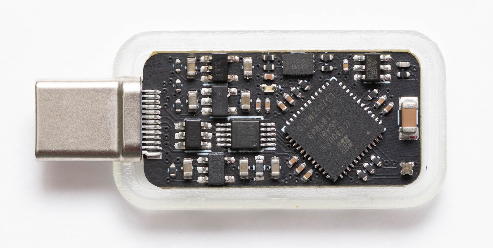

# Tillitis Key 1

## Introduction

Tillitis Key 1 (TK1) is a new kind of USB security token. What makes
the TK1 unique is that it allows a user to load and run applications on
the device, while still providing security. This allow for open ended,
flexible usage. Given the right application, the TK1 can support use
cases such as SSH login, Ed25519 signing, Root of Trust, FIDO2, TOTP,
Passkey and more.

During the load operation, the device measures the application
(calculates a cryptographic hash digest over the) before running
it on the open hardware security processor. This measurement
is similar to [TCG DICE](https://trustedcomputinggroup.org/work-groups/dice-architectures/).

Each TK1 device contains a Unique Device Secret (UDS), which
together with the application measurement, and an optional
user-provided seed, is used to derive key material unique to each
application. This guarantees that if the integrity of the application
loaded onto the device has been tampered with, the correct keys
needed for an authentication will not be generated.

The key derivation with user provided seed allows users to build and
load their own apps, while ensuring that each app loaded will have
its own cryptographic identity, and can also be used for authentication
towards different services.

The TK1 platform is based around a 32-bit RISC-V processor and has
128 KB of RAM. The current firmware is designed to load an app that is
up to 100 KB in size, and gives it a stack of 28 KB. A smaller app may
move itself in memory to get larger continuous memory.

All of the TK1 software, FPGA logic, schematics, and PCB layout are
open source, as all security software and hardware should be. This in
itself makes it different, as other security tokens utilize closed source
hardware for its security-critical operations.

*Tillitis Key 1 PCB, first implementation*

## Documentation

* [System Description](doc/system_description/system_description.md)
* [Threat Model](doc/threat_model/threat_model.md)
* [Framing Protocol](doc/framing_protocol/framing_protocol.md)
* [Boards](hw/boards/README.md)
* [Software](doc/system_description/software.md)
* [Firmware](hw/application_fpga/fw/tk1/README.md)
* [Toolchain setup](doc/toolchain_setup.md)
* [Quickstart](doc/quickstart.md) to program the Tillitis Key 1
* [Release Notes](doc/release_notes.md)

Note that development is ongoing. For example, changes might be made
to the measuring and derivation of key material, causing the
public/private keys of a signer app to change. To avoid unexpected
changes, please use a tagged release. Read the [Release
Notes](doc/release_notes.md) to keep up to date with changes and new
releases.

Applications and host programs that communicate with the apps are kept
in this repository: https://github.com/tillitis/tillitis-key1-apps

## About this repository

This repository contains hardware, software and utilities written as
part of the Tillitis Key 1 project. It is structured as monolithic
repository, or "monorepo", where all components live in one
repository.

The repository follows the [OpenTitan
layout](https://docs.opentitan.org/doc/ug/directory_structure/).

## Licensing

See [LICENSES](./LICENSES/README.md) for more information about
the projects' licenses.

All contributors must adhere to the [Developer Certificate of Origin](dco.md).
