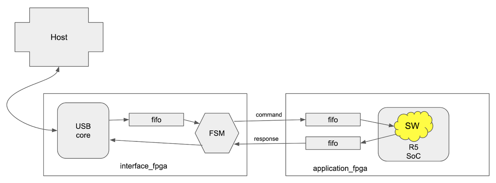
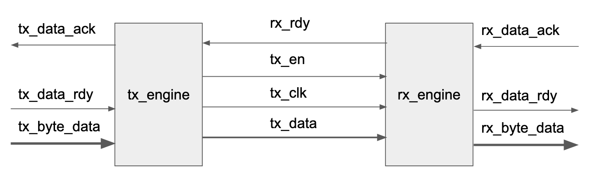

# Framing Protocol

#### Version
* Version: Draft 1.3
* 2021-12-20

## 1 Introduction
This document describes a proposal for a transport level communication
protocol for the TK1 USB connected secure application device. The
proposal describes the different endpoints, the different levels in
the stack, framing and encoding.

## 2 System description and problem statement
The TK1 is a USB connected device. The device provides a secure
compute platform and environment for applications providing some
service and function to (the user of) the USB host. Examples of
applications that can be implemented are AUTH token generators, Root
of Trust, and signing oracles.

The TK1 is implemented using FPGA devices, and the computer
functionality is based on RISC-V. Conceptually, the TK1 consists of
three levels:

1. The hardware level. The actual FPGA devices and the hardware
   implemented in them, for example the RISC-V core, the application and
   data memories, but also timers, true random number generators and
   hardware access control.

2. The TK1 firmware and SDK level. The TK1 contains SW functionality
   (called firmware - FW) used to set up the application environment,
   but also provide the applications with things like host
   communication (the protocol described in this document), key
   generation, timers etc.

   Similarly, the SDK provides similar convenience functions for the
    host side applications. Allowing host side applications to load
    applications on the TK1, and then communicate with, use the
    applications running on the TK1.

3. The applications running on the TK1, the corresponding host SW.

The hardware, the FW as well as the applications can be endpoints with
which programs on the host may communicate. This means that we need to
be able to address different endpoints in the TK1. And, crucially, the
applications and their corresponding host SW may communicate using
custom protocols that are not known today.

This means that we need a general transport mechanism for commands to,
and responses from the endpoints in the TK1. Due to the constrained
environment the transport mechanism must be “light”, that is both easy
to implement and to require few resources

### 2.1 TK1 system description details
The TK1 consists of two FPGA devices - interface_fpga and
application_fpga.

The interface_fpga contains a USB core and FPGA-local control
functionality (a Finite State Machine - FSM). The FSM is responsible for
sending and receiving bytes to and from the
application_fpga. Additionally, the FSM is the endpoint for commands
directed to the HW in the interface_fpga. This allows the interface_fpga
to provide functionality such as controlling the reset of the
application_fpga, or provide host access to an entropy source.

The application_fpga contains FIFOs and control functionality needed to
receive commands from the host (via the interface_fpga), and send back
responses. The application_fpga also contains a System on Chip (SoC)
with a PicoRV32 CPU core, memories for code and data
storage. Additionally, the SoC includes functionality to provide a
unique device secret (UDS), secure hashing, timers etc. Finally the
application_fpga contains FW stored in read-only memory.

Figure 1 shows the high level architecture that illustrates the
bidirectional data flows between the host and the interface_fpga. And
then the separate command end response flows inside and between the
FPGAs.

*Figure 1: High level architecture with data flows.*

Note that in the application_fpga it is FW and SW (application) that
acts as endpoints, and they are responsible for interpreting commands
and sending responses.

## 3 Protocol description
The communication is driven by the host and the protocol is
command-response based. The host sends a command, and the TK1 must
always send a response to a given command. Commands are processed by
the TK1 in order. If the host sends a new command before receiving a
response to the previous command, it is the responsibility of the host
to determine to which command a received response belongs to.

Commands and responses are sent as frames with a constrained set of possible lengths.
It is the endpoints that are communicating that decides what the data in
the command and response frames mean, and if the commands and responses
are valid and make sense.

### 3.1 Command frame format
A command frame consists of a single header byte followed by one or more
data bytes. The number of data bytes in the frame is given by the header
byte. The header byte also specifies the endpoint for the command.

The bits in the command header byte should be interpreted as:
* Bit [7] (1 bit). Reserved - possible protocol version.

* Bits [6..5] (2 bits). Frame ID tag.

* Bits [4..3] (2 bits). Endpoint number.
0. HW in interface_fpga
1. HW in application_fpga
2. FW in application_fpga
3. SW (application) in application_fpga

* Bit [2] (1 bit). Unused. MUST be zero.

* Bits [1..0] (2 bits). Command data length.
0. 1 byte
1. 4 bytes
2. 32 bytes
3. 128 bytes

Note that the number of bytes indicated by the command data length field
does **not** include the command header byte. This means that a complete
command frame, with a header indicating a data length of 128 bytes, is
129 bytes in length.

Note that the host sets the frame ID tag. The ID tag in a given command
MUST be preserved in the corresponding response to the command.

#### 3.1.1 Command frame examples
Note that these examples mostly don't take into account that the first
byte in the data (following the command header byte) typically is
occupied by the particular app or FW command requested, so there is 1
byte less available for the "payload" of the command.

Some examples to clarify endpoints and commands:

* 0x00: A command to the HW in the interface_fpga with a single byte of
  data. The single byte could indicate action such as reading from the
  TRNG or resetting the application_fpga.

* 0x13: A command to the FW in the application_fpga with 128 bytes of
  data. The data could for example be parts of an application binary to
  be loaded into the program memory.

* 0x1a: A command to the application running in the application_fpga
  with 32 bytes of data. The data could be a 32 byte challenge to be
  signed using a private key derived in the TK1.

### 3.2 Response frame format
A response consists of a single header byte followed by one or more bytes.

The bits in the response header byte should be interpreted as:
* Bit [7] (1 bit). Reserved - possible protocol version.

* Bits [6..5] (2 bits). Frame ID tag.

* Bits [4..3] (2 bits). Endpoint number.
0. HW in interface_fpga
1. HW in application_fpga
2. FW in application_fpga
3. SW (application) in application_fpga

* Bit [2] (1 bit). Response status.
0. OK
1. Not OK (NOK)

* Bits [1..0] (2 bits). Response data length.
0. 1 byte
1. 4 bytes
2. 32 bytes
3. 128 bytes

Note that the number of bytes indicated by the response data length field
does **not** include the response header byte. This means that a complete
response frame, with a header indicating a data length of 128 bytes, is
129 bytes in length.

Note that the ID in a response MUST be the same ID as was present in the
header of the command being responded to.

#### 3.2.1 Response frame examples
Note that these examples mostly don't take into account that the first
byte in the data (following the response header byte) typically is
occupied by the particular app or FW response code, so there is 1 byte
less available for the "payload" of the response.

* 0x01: A successful command to the HW in the interface_fpga, which
  responds with four bytes of data. For example the interface_fpga
  VERSION string.

* 0x14: An unsuccessful command to the FW in the application_fpga which
  responds with a single byte of data.

* 0x1b: A successful command to the application running in the
  application_fpga. The response contains 128 bytes of data, for example
  an EdDSA Ed25519 signature.

### 3.3 Command frame parsing and transfer
Commands are sent via USB to the interface_fpga. The Commands are
buffered in the interface_fpga FIFO until the transfer_agent FSM is able
to transfer the command to the correct endpoint (see Figure 1). To this
end, the command header is parsed by the FSM in the interface_fpga to
determine if the endpoint is in the interface_fpga itself, or if the
command should be transferred to the application_fpga. Commands for the
interface_fpga are processed by HW-functionality in the interface_fpga.

For commands to be transferred to the application, the transfer engine
in the interface_fpga will interrogate the status of the
application_fpga to determine that it can receive one or more bytes. If
the application_fpga is capable of receiving the bytes, the transfer
agent sends over the command bytes including the command byte to the
application_fpga.

### 3.3 Response frame parsing and transfer
HW in the interface FPGA is responsible for detecting responses from any
of the endpoints. If an endpoint has a response, the HW in the
interface_fpga will extract the response and send it to the USB
interface for delivery to the host. The HW in the interface_fpga will
parse the response header bytes to determine how many bytes to expect.

For responses from the application_fpga, the HW in the interface_fpga
will detect available bytes. When the HW in the interface_fpga is ready
to send a response, it will extract bytes from the application_fpga and
send them to the USB interface.

## 4 Inter-FPGA interface functionality
There are two communication directions between the FPGAs - with commands
from the interface_fpga to the application_fpga, and with responses from
the application_fpga to the interface_fpga. The important thing to note
is that the directions are operated independently from each other.

### 4.1 transfer engines
The line interfaces used for each direction are identical and use the
same design. But the direction and thus the transmitter and receiver are
instantiated differently for each direction. This means that each FPGA
contains one tx_engine and one rx_engine.

For commands the cmd_tx_engine is located in the interface_fpga, and the
cmd_rx_engine is located in the application_fpga. For responses the
response_tx_engine is located in the application_fpga, and the
response_rx_engine is located in the interface_fpga.

### 4.2 Line interface
The line interface is a synchronous, byte oriented
interface. Communication is driven by the tx_engine. Communication
starts when the tx_engine has a byte to send, and the rx_engine
indicates that it can receive a byte. The tx_engine sets the tx_en
signal, starts running the tx_clk and shifts out the data bits in the
byte to be transmitted. When all bits have been sent, the tx_engine must
drop the en_signal for a cycle and check if the rx_engine is ready to
receive a new byte.

Bits on the tx_data lines are updated by the tx_engine on the positive
edge of the tx_clk. Bits are sampled by the rx_engine on the negative
edge of the tx_clk. Bits are sent MSB first. The minimum number of
wires, with a single tx_data wire is four. With two bit wide tx_data,
the number of wires is five. This requires a total of 10 wires between
the FPGAs. Figure 2 shows the ports including direction for the
tx_engine and the rx_engine.

*Figure 2: The tx_engine and the rx_engine with connections.*

## 5. References
To Be Written.
