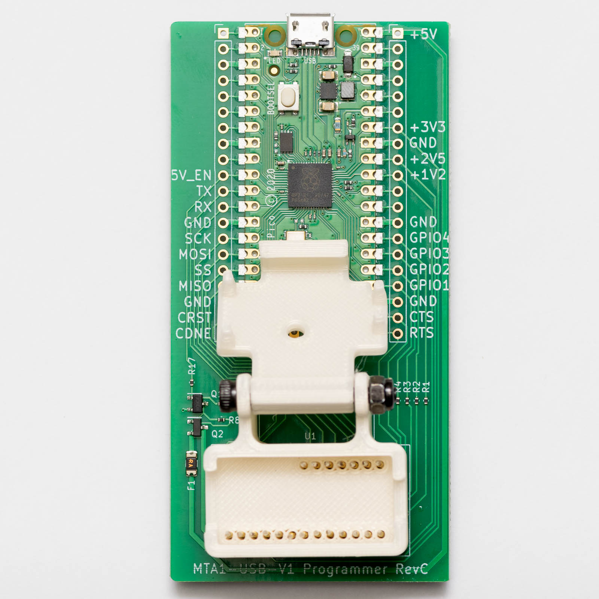
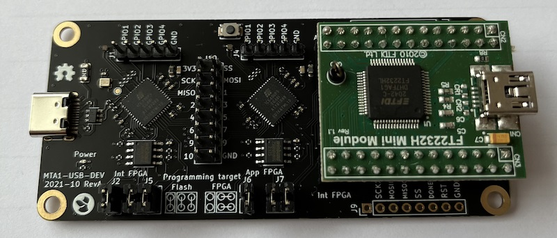

# Tillitis PCB designs

## Introduction

Tillitis develop boards (PCBs) and enclposures for the TKey devices as
well support systems such as FPGA programmers. Tillitis use open source
tools for the PCB designs.

## Boards

The KiCad board projects all follow this directory structure:

| Path | Description |
| ---  | --- |
| /project | KiCad 6 project |
| /project/gerbers | PCB release files |
| /project/test | Scripts / gateware used for production tests |

### TKey 1 (TK1)

This is the first production version of the TKey design.

Main features:
* Miniaturized hardware the size of a small USB stick.

* The Interface FPGA from the MTA1-USB-DEV design has been replaced with an Interface
  MCU running a USB-to-Serial converter firmware. This was done to ease development
  of the FPGA design.

* A touch sensor IC is provided instead of the switch for user presence detection.

* Test pads are provided on the bottom of the board for programming the SPI flash,
  and also for measuring extra GPIO pins. The 'MTA1-USB-V1-Programmer' board is
  designed to support this.

### mta1-usb-v1-programmer

This is a programming jig for TKey 1 (the mta1-usb-v1) board The progamming board is based
around a on a Raspberry Pi Pico running a custom firmware developed by Blinkinlabs.

The source code for this firnware [is available on Github](https://github.com/Blinkinlabs/ice40_flasher).
There is also a [pre built firmware binary available for the programmer board](https://github.com/Blinkinlabs/ice40_flasher/tree/main/bin)

### mta1-usb-dev

This is the original TKey design, intended as a development platform. It is a larger PCB,
that connects to a PC via a USB C cable.

Main features:
* 2 ICE40 FPGAs.

* The first ICE40 (Interface FPGA) is connected to a USB C plug, and is loaded with a
  gateware that contains a soft USB device. This gateware acts as an USB-to-GPIO
  interface to the second ICE40.

* The second ICE40 (application FPGA) is loaded with a RISC-V soft core containing
  the security firmware. User applications are run on this gateware.

* The second ICE40 also has an input button for user presenence detection.

* An FTDI module is included for programming both the Application and Interface FPGAs.

* Both ICE40s can be configured to boot from included SPI flash memories, NVCM,
  or be live programmed from the FTDI module.

* All GPIO lines between the two FPGAs, as well as all programming signals, are
  exposed on 0.1" headers for probing.

## Libraries

### mta1-library

This is a shared KiCad library for all boards in the project.

### KiCad-RP Pico

This is a KiCad library for the Raspberry Pi Pico symbol and footprint. It was extracted from
the [Kicad-RP-Pico](https://github.com/ncarandini/KiCad-RP-Pico) project. It is licensed under
the [Creative Commons CC-BY-SA 4.0 License](https://creativecommons.org/licenses/by-sa/4.0/legalcode),
with an exception exempting waving any control of derived works.

---
