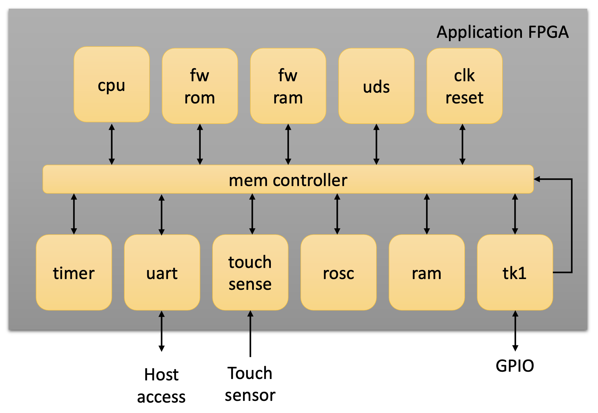

# TKey hardware design

The application FPGA is implemented using a Lattice [iCE40 UltraPlus
UP5K
device](https://www.latticesemi.com/en/Products/FPGAandCPLD/iCE40UltraPlus).
Only open tools are used in the toolchain.

The design top level is in `rtl/application_fpga.v`. It contains
instances of all cores as well as the memory system.

The memory system allows the CPU to access cores in different ways
given the current execution mode. There are two execution modes -
firmware and application. Basically, in application mode the access is
more restrictive.

The rest of the components are under `cores`. They typically have
their own `README.md` file documenting them and their API in detail.

Hardware functions with APIs, assets, and input/output are memory
mapped starting at base address `0xc000_0000`. For specific offsets
and bitmasks, see the file `fw/tk1_mem.h`.

Rough memory map:

| *name*  | *prefix* |
|---------|----------|
| ROM     | 0x00     |
| RAM     | 0x40     |
| TRNG    | 0xc0     |
| Timer   | 0xc1     |
| UDS     | 0xc2     |
| UART    | 0xc3     |
| Touch   | 0xc4     |
| FW\_RAM | 0xd0     |
| TK1     | 0xff     |

## `clk_reset_gen`

Generator for system clock and system reset.

The device does not rely on external clock or reset. Instead the
internal HFOSC oscillator combined with an internal PLL is used to
generate the main clock. Currently the clock frequency driving the SoC
is 21 MHz.

The device also generates its own reset.

## `fw_ram`

Special firmware-only RAM. Unreachable from app mode.

## `picorv32`

A softcore 32 bit RISC-V CPU from [upstreams
PicoRV32](https://github.com/YosysHQ/picorv32).

Configuration of optional CPU features like `ENABLE_FAST_MUL` et
cetera are in `rtl/application_fpga.v`.

The instance enables the following features

- Compressed ISA (C extension)
- Fast multiplication. Two cycles for 32x32 multiplication
- Barrel shifter

No other modification to the core has been done. No interrupts are
used.

## `ram`

The 128 KByte main RAM. The RAM is only used by applications.
The memory is cleared by firmware before an application is loaded.

The application RAM is available to use by firmware and applications.

The RAM core also implements (from the view of the CPU) transparent
RAM address and data scrambling. This scrambling is applied to make it
harder to extract application and application data from a memory dump
directly from the memory cores.

## `rom`

ROM for the firmware. The firmware.elf minus the ELF header is
embedded here in the bitstream.

After reset the CPU will initialize the program counter to start of
ROM.

## `timer`

A general purpose 32 bit timer. The timer will count down from the
initial value to one. In order to handle long time sequences (minutes,
hours, days) there is also a 32 bit prescaler.

The timer is available to use by firmware and applications.

## `tk1`

See [tk1 README](core/tk1/README.md) for details.

Contains:

- FPGA name and version.
- Execution mode control: firmware mode/application mode.
- RGB LED control.
- General purpose input/output (GPIO) pin control.
- Application introspection: start address and size of binary.
- BLAKE2s function access.
- Compound Device Identity (CDI).
- Unique Device Identity (UDI).
- RAM memory protection.
- Security monitor.
- SPI main.
- System reset.

### Illegal instruction monitor

Execution of illegal instructions will cause the CPU to enter its trap
state from which it can't exit. The hardware in the TKey will monitor
the CPU state. If the CPU enters the trap state, the hardware will
start flashing the RED led, signalling that the TKey is stuck in an
error state.

### RAM memory protection

The TKey hardware includes a simple form of RAM memory protection. The
purpose of the RAM memory protection is to make it somewhat harder and
more time consuming to extract application assets by dumping the RAM
contents from a TKey device. The memory protection is not based on
encryption and should not be confused with real encryption. The
protection is randomised between power cycles. The randomisation
should make it infeasible to improve asset extraction by observing
multiple memory dumps from the same TKey device. The attack should
also not directly scale to multiple TKey devices.

The RAM address and data scrambling is done in de RAM core.

The memory protection is setup by the firmware. Access to the memory
protection controls is disabled for applications. Before the memory
protecetion is enabled, the RAM is filled with randomised data using
Xorwow. So during boot the firmware perform the following steps to
setup the memory protection:

1. Get a random 32-bit value from the TRNG to use as data state for
   Xorwow.
2. Get a random 32-bit value from the TRNG to use as accumulator
   for Xorwow.
3. Fill RAM with a random sequence of values by writing to all RAM
   addresses. For each address use Xorwow to generate a new state,
   using the accumulator.
4. Write a random 32-bit value from the TRNG into the
   ADDR\_RAM\_ADDR\_RAND register.
5. Write a random 32-bit value from the TRNG into the
   ADDR\_RAM\_DATA\_RAND register.
6. Receive the application sent from the client and write it in
   sequence into RAM.

## `touch_sense`

Provide touch sensor events to software.

It is recommended that software start by acknowledge any stray events
prior to signalling to the user that a touch event is expected and
then start waiting for an event.

The touch sensor is available to use by firmware and applications.

## `trng`

Provide a True Random Number Generator to software.

The TRNG generates entropy with a fairly good quality. However for
security related use cases, for example key generation, the TRNG
should not be used directly. Instead use it to create a seed, and
reseed as necessary, for a Digital Random Bit Generator (DRBG), also
known as a Cryptographically Safe Pseudo Random Number Generator
(CSPRNG). Examples of such generators are Hash\_DRGG, CTR\_DRBG, and
HKDF.

## `uart`

A simple universal asynchronous receiver/transmitter (UART) used for
communication with the client through the USB controller.

The UART contain a 512-byte Rx-FIFO with status (data available).

The UART is available to use by firmware and applications.

## `uds`

The Unique Device Secret. During build initial value is taken from
`data/uds.hex`.

However, with the finished bitstream you can patch in another UDS and
UDI by using `tools/patch_uds_udi.py` with nextpnr.

It's a 256 bit memory implemented using eight 32-bit registers. The
registers can only be accessed once between power cycling. This means
that the UDS **must** be read as u32. If read as u8, only the first
byte from a given address will be correct, subsequent bytes will be
zero.

The UDS can only be read in firmware mode. Reading from the UDS in
application mode will return all zeros.

## References
More detailed information about the firmware running on the device can
be found in the
[hw/application_fpga/fw/README.md](hw/application_fpga/fw/README.md).
