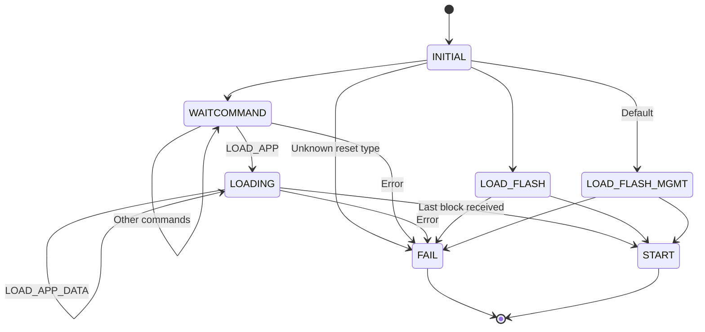

# Firmware implementation notes

## Introduction

This text is specific for the firmware, the piece of software in TKey
ROM. For a more general description on how to implement device apps,
see [the TKey Developer Handbook](https://dev.tillitis.se/).

## Definitions

- Firmware: Software in ROM responsible for loading, measuring,
  starting applications, and providing system calls. The firmware is
  included as part of the FPGA bitstream and not replaceable on a TKey
  (note: on TKey Unlocked the user themself program the TKey and can
  choose not to lock the memory in TKey and thus leave it open for
  re-programming).
- Client: Software running on a computer or a mobile phone the TKey is
  inserted into.
- Device application or app: Software supplied by the client or from
  flash that runs on the TKey.

## CPU modes and firmware

The TKey has two modes of software operation: firmware mode and
application mode. The TKey always starts in firmware mode when it
starts the firmware. When the application starts the hardware
automatically switches to a more constrained environment: the
application mode.

The TKey hardware cores are memory mapped but the memory access is
different depending on mode. Firmware has complete access, except that
the Unique Device Secret (UDS) words are readable only once even in
firmware mode. The memory map is constrained when running in
application mode, e.g. FW\_RAM and UDS isn't readable, and several
other hardware addresses are either not readable or not writable for
the application.

When doing system calls from a device app the context switches back to
firmware mode. However, the UDS is still not available, protected by
two measures: 1) the UDS words can only be read out once and have
already been read by firmware when measuring the app, and, 2) the UDS
is protected by hardware after the execution leaves ROM for the first
time.

See the table in [the Developer
Handbook](https://dev.tillitis.se/memory/) for an overview about the
memory access control.

## Communication

The firmware communicates with the client using the
`UART_{RX,TX}_{STATUS,DATA}` registers. On top of that it uses three
protocols: The USB Mode protocol, the TKey framing protocol, and the
firmware's own protocol.

To communicate between the CPU and the CH552 USB controller it uses an
internal protocol, used only within the TKey, which we call the USB
Mode Protocol. It is used in both directions.

| *Name*   | *Size*    | *Comment*                          |
|----------|-----------|------------------------------------|
| Endpoint | 1B        | Origin or destination USB endpoint |
| Length   | 1B        | Number of bytes following          |
| Payload  | See above | Actual data from or to firmware    |

The different endpoints:

| *Name* | *Value* | *Comment*                                                            |
|--------|---------|----------------------------------------------------------------------|
| CH552  | 0x04    | USB controller control                                               |
| CDC    | 0x08    | USB CDC-ACM, a serial port on the client.                            |
| FIDO   | 0x10    | A USB FIDO security token device, useful for FIDO-type applications. |
| CCID   | 0x20    | USB CCID, a port for emulating a smart card                          |
| DEBUG  | 0x40    | A USB HID special debug pipe. Useful for debug prints.               |

You can turn on and off different endpoints dynamically by sending
commands to the `CH552` control endpoint. When the TKey starts only
the `CH552` and the `CDC` endpoints are active. To change this, send a
command to `CH552` in this form:

| *Name*   | *Size* | *Comment*                     |
|----------|--------|-------------------------------|
| Command  | 1B     | Command to the CH552 firmware |
| Argument | 1B     | Data for the command          |

Commands:

| *Name*           | *Value* | *Argument*           |
|------------------|---------|----------------------|
| Enable endpoints | 0x01    | Bitmask of endpoints |

On top of the USB Mode Protocol is [the TKey Framing
Protocol](https://dev.tillitis.se/protocol/) which is described in the
Developer Handbook.

The firmware uses a protocol on top of this framing layer which is
used to load a device application. All commands are initiated by the
client. All commands receive a reply. See [Firmware
protocol](http://dev.tillitis.se/protocol/#firmware-protocol) in the
Dev Handbook for specific details.

## Memory constraints

| *Name*  | *Size*    | *FW mode* | *App mode* |
|---------|-----------|-----------|------------|
| ROM     | 8 kByte   | r-x       | r          |
| FW\_RAM | 4 kByte*  | rw-       | -          |
| RAM     | 128 kByte | rwx       | rwx        |

* FW\_RAM is divided into the following areas:

- firmware stack: 3000 bytes.
- `resetinfo` area: 256 bytes.
- `.data` and `.bss`: 840 bytes.

## Firmware behaviour

The purpose of the firmware is to:

1. Load, measure, and start an application received from the client
   over the USB/UART or from one of two flash app slots.
2. Provide functionality to run only apps with specific BLAKE2s
   digests.
3. Provide system calls to access the filesystem and get other data.
4. To help measure data into the new Compound Device Identifier when
   chaining apps.

The firmware binary is part of the FPGA bitstream as the initial
values of the Block RAMs used to construct the ROM. The ROM is located
at `0x0000_0000`. This is also the CPU reset vector.

### Reset type

When the TKey is started or reset it can load an app from different
sources. We call this the reset type. Reset type is located in the
`resetinfo` part of FW\_RAM. The different reset types loads and start
an app from:

1. Flash slot 0 (default): `FLASH0` with a specific app hash defined
   in a constant in firmware.
2. Flash slot 1: `FLASH1`.
3. Flash slot 0 with a specific app hash left from previous app:
   `FLASH0_VER`
4. Flash slot 1 with a specific app hash left from previous app:
   `FLASH1_VER`.
5. Client: `CLIENT`.
6. Client with a specific app hash left from previous app:
   `CLIENT_VER`.

### Firmware state machine

Change of state occur when we receive specific I/O or a fatal error
occurs.



States:

- *INITIAL*: Transitions to next state through reset type left in
  `FW_RAM`.
- *WAITCOMMAND*: Waiting for initial commands from client. Allows the
  commands `NAME_VERSION`, `GET_UDI`, `LOAD_APP`.
- *LOADING*: Expecting application data from client. Allows only the
  command `LOAD_APP_DATA` to continue loading the device app.
- *LOAD_FLASH*: Loading an app from flash. Allows no commands.
- *LOAD_FLASH_MGMT*: Loading an app from flash and registering it as a
  prospective managment app. Allows no commands.
- *START*: Computes CDI. Possibly verifies app. Starts the
  application. Does not return to firmware. Allows no commands.
- *FAIL* - Halts CPU. Allows no commands.

Allowed data in state *INITIAL*:

| *reset type* | *next state*      |
|--------------|-------------------|
| `FLASH0`     | *LOAD_FLASH_MGMT* |
| `FLASH1`     | *LOAD_FLASH*      |
| `FLASH0_VER` | *LOAD_FLASH*      |
| `FLASH1_VER` | *LOAD_FLASH*      |
| `CLIENT`     | *WAITCOMMAND*     |
| `CLIENT_VER` | *WAITCOMMAND*     |
| unknown      | *FAIL*            |

I/O in state *LOAD_FLASH*:

| *I/O*              | *next state* |
|--------------------|--------------|
| Last app data read | *START*      |

I/O in state *LOAD_FLASH_MGMT*:

| *I/O*              | *next state* |
|--------------------|--------------|
| Last app data read | *START*      |

Commands in state *WAITCOMMAND*:

| *command*             | *next state*                               |
|-----------------------|--------------------------------------------|
| `FW_CMD_NAME_VERSION` | unchanged                                  |
| `FW_CMD_GET_UDI`      | unchanged                                  |
| `FW_CMD_LOAD_APP`     | *LOADING* or unchanged on invalid app size |

Commands in state *LOADING*:

| *command*              | *next state*                       |
|------------------------|------------------------------------|
| `FW_CMD_LOAD_APP_DATA` | unchanged or *START* on last chunk |

No other states allows commands.

See [Firmware protocol in the Dev
Handbook](http://dev.tillitis.se/protocol/#firmware-protocol) for the
definition of the specific commands and their responses.

Plain text explanation of the states:

- *INITIAL*: Start here. Check the `FW_RAM` for the `resetinfo` type
  for what to do next.

  For type `FLASH0` transition to *LOAD_FLASH_MGMT* because the app in
  slot 0 is considered a special management app. For all other types
  beginning with `FLASH*` transition to *LOAD_FLASH* to load an
  ordinary app from flash.

  For type `CLIENT*` transition to *WAITCOMMAND* to expect a device app
  from the client.

  If type is unknown, error out.

- *LOAD_FLASH*: Load device app from flash into RAM, app slot taken
  from context. Compute a BLAKE2s digest over the entire app.
  Transition to *START*.

- *LOAD_FLASH_MGMT*: Load device app from flash into RAM, app slot
  always 0. Compute a BLAKE2s digest over the entire app. Register the
  app as a prospective management app. Transition to *START*.

- *WAITCOMMAND*: Wait for commands from the client. Transition to
  *LOADING* on `LOAD_APP` command, which also sets the size of the
  number of data blocks to expect.

- *LOADING*: Wait for several `LOAD_APP_DATA` commands until the last
  block is received, then transition to *START*.

- *START*: Compute the Compound Device Identifier (CDI). If we have a
  registered verification digest, verify that the app we are about to
  start is indeed the correct app. This also means that a prospective
  management app is now verified.

  We can compute the CDI in two different ways. See [Compound Device
  Identifier computation](#compound-device-identifier-computation) below

  Clean up firmware data structures, enable the system calls, and
  start the app, which ends the firmware state machine. Hardware
  guarantees that we leave firmware mode automatically when the
  program counter leaves ROM.

- *FAIL*: Execute an illegal instruction which traps the CPU. Hardware
  detects a trapped CPU and blinks the status LED in red until power
  loss. No further instructions are executed.

After leaving *START* the device app is now running in application
mode. We can, however, return to firmware mode (excepting access to
the UDS) by doing system calls. Note that ROM is still readable, but
is now hardware protected from execution, except through the system
call mechanism.

If during this whole time any commands are received which are not
allowed in the current state, or any errors occur, we enter the *FAIL*
state.

### Golden path from start to default app

Firmware will load the device application at the start of RAM
(`0x4000_0000`) from either flash or from the client through the UART.
Firmware is using a part of the FW\_RAM for its own stack.

When reset is released, the CPU starts executing the firmware. It
begins in `start.S` by clearing all CPU registers, clears all FW\_RAM,
except the part reserved for the `resetinfo` area, sets up a stack for
itself there, and then jumps to `main()`. Also included in the
assembly part of firmware is an interrupt handler for the system
calls, but the handler is not yet enabled.

Beginning at `main()` it fills the entire RAM with pseudo random data
and setting up the RAM address and data hardware scrambling with
values from the True Random Number Generator (TRNG).

Firmware then proceeds to:

1. Read the partition table from flash and store in FW\_RAM.

2. Reset the CH552 USB controller to a known state, only allowing the
   CDC USB endpoint and the internal command channel between the CPU
   and the CH552.

3. Check the special `resetinfo` area in FW\_RAM for reset type. Type
   zero means default behaviour, load from flash app slot 0, expecting
   the app there to have a specific hard coded BLAKE2s digest.

4. Load app data from flash slot 0 into RAM.

5. Compute a BLAKE2s digest of the loaded app.

6. Compare the computed digest against the allowed app digest
   hard coded in the firmware. If it's not equal, halt CPU.

7. [Start the device app](#start-the-device-app).

### Start the device app

1. Check if there is a verification digest left from the previous app
   in the `resetinfo` area. If it is, compare with the loaded app's
   already computed digest. Halt CPU if different.

2. Compute the Compound Device Identifier
   ([CDI](#compound-device-identifier-computation)).

3. Write the start address of the device app, currently `0x4000_0000`,
   to `APP_ADDR` and the size of the loaded binary to `APP_SIZE` to
   let the device application know where it is loaded and how large it
   is, if it wants to relocate in RAM.

4. Clear the stack part of `FW_RAM`.

5. Enable system call interrupt handler.

6. Start the application by jumping to the contents of `APP_ADDR`.
   Hardware automatically switch from firmware mode to application
   mode. In this mode some memory access is restricted, e.g. some
   addresses are inaccessible (`UDS`), and some are switched from
   read/write to read-only (see [the memory
   map](https://dev.tillitis.se/memory/)).

### Management app, chaining apps and verified boot

Normally, the TKey measures a device app and mixes it together with
the Unique Device Secret in hardware to produce the [Compound Device
Identifier]((#compound-device-identifier-computation)). The CDI can
then be used for creating key material. However, since any key
material created like this will change if the app is changed even the
slightest, this make it hard to upgrade apps and keep the key
material.

This is where a combination of measured boot and verified boot comes
in!

To support verified boot the firmware supports reset types with
verification. This means that the firmware will load an app as usual
either from flash or from the client, but before starting the app it
will verify the new app's computed digest with a verification digest.

Such a verified boot loader app:

- Might be loaded from either flash or client.

- Typically includes a security policy, for instance a public key and
  code to check a cryptographic signature.

- Can be specifically trusted by firmware to be able to do filesystem
  management to be able to update an app slot on flash. Add the app's
  digest to `allowed_app_digest` in `mgmt_app.c` to allow it to use
  `PRELOAD_DELETE`, `PRELOAD_STORE`, `PRELOAD_STORE_FIN`, and
  `PRELOAD_GET_METADATA`.

It works like this:

- The app reads a digest of the next app in the chain and the
  signature over the digest from either the filesystem (system call
  `PRELOAD_GET_METADATA`) or sent from the client.

- If the signature provided over the digest is verified against the
  public key the app use the system call `RESET` with the reset type
  set to `START_FLASH0_VER`, `START_FLASH1_VER`, or `START_CLIENT_VER`
  depending on where it wants the next app to start from. It also
  sends the now verified app digest to the firmware in the same system
  call.

- The app leaves something it want's to be measured by the firmware
  for the coming CDI, typically a digest of its own security policy,
  like a vendor public key.

- The key is reset and firmware starts again. It checks:

  1. The reset type. Start from client or a slot in the filesystem?
  2. The expected digest of the next app.

- Firmware loads the app from the expected source.

- Firmware refuses to start if the loaded app has a different digest.

- If the app was allowed to start it can use the CDI as usual for its
  key material. See the [Compound Device Identifier
  computation](#compound-device-identifier-computation) for more about
  the different CDI computations.

### App loaded from client

The default is always to start from a verified app in flash slot
0. To be able to load an app from the client you have to send
something to the app to reset the TKey with a reset type of
`START_CLIENT` or `START_CLIENT_VER`.

After reset, firmware will:

1. Wait for data coming in through the UART.

2. The client sends the `FW_CMD_LOAD_APP` command with the size of
   the device app and the optional 32 byte hash of the user-supplied
   secret as arguments and gets a `FW_RSP_LOAD_APP` back. After
   using this it's not possible to restart the loading of an
   application.

3. On a successful response, the client will send multiple
   `FW_CMD_LOAD_APP_DATA` commands, together containing the full
   application.

4. On receiving`FW_CMD_LOAD_APP_DATA` commands the firmware places
   the data into `0x4000_0000` and upwards. The firmware replies
   with a `FW_RSP_LOAD_APP_DATA` response to the client for each
   received block except the last data block.

5. When the final block of the application image is received with a
   `FW_CMD_LOAD_APP_DATA`, the firmware measure the application by
   computing a BLAKE2s digest over the entire application. Then
   firmware send back the `FW_RSP_LOAD_APP_DATA_READY` response
   containing the digest.

6. [Start the device app](#start-the-device-app).

### User-supplied Secret (USS)

USS is a 32 bytes long secret provided by the user. Typically a client
program gets a secret from the user and then does a key derivation
function of some sort, for instance a BLAKE2s, to get 32 bytes which
it sends to the firmware to be part of the CDI computation.

Note: From the user’s perspective, the USS can be any length—there is
no minimum or maximum. The client program must safely convert the user
input into a 32-byte value.

### Compound Device Identifier computation

The CDI is computed in one of two ways.

1. CDI is a result of a hash of the Unique Device Secret, a domain
   byte with the measured-id bit cleared, the digest of the entire
   loaded app, and optionally the User Supplied Secret, if sent from
   the client:

   ```C
   CDI = blake2s(UDS, domain, blake2s(app), USS)
   ```

   This is the default case.

2. CDI is a result of a hash of the Unique Device Secret, a domain
   byte with the measured-id bit set, something left by the previous
   app, and optionally the User Supplied Secret, if sent from the
   client:

   ```C
   CDI = blake2s(UDS, domain, blake2s(previous-CDI, measured_id_seed)*, USS)
   ```

  This alternative computation is only done if the `mask` in `struct
  reset` includes `RESET_SEED`.

  Note that this is done in two parts, before and after reset, in
  order not to leak CDI between resets.

  1. Before reset (marked with an asterisk above): Typically a calling
     app would do a `TK1_SYSCALL_RESET` system call and fill in
     something it wants to be mixed into the new CDI in
     `measured_id_seed`, The firmware will then mix a new
     `measured_id` before doing the actual reset:

     ```C
     measured_id = blake2s(CDI, measured_id_seed)
      ```

  2. After reset: `measured_id` will survive the reset and will then
     be used in the actual CDI computation after the reset.

The domain byte is used to separate the following cases:

| *Bitstring* | *Value* | *Comment*                     |
|-------------|---------|-------------------------------|
| 00          | 0       | Directly loaded app, no USS   |
| 01          | 1       | Directly loaded app, with USS |
| 10          | 2       | Chained app, no USS           |
| 11          | 3       | Chained app, with USS         |

- Directly loaded app: the app's BLAKE2s digest is used.
- Chained app: the `measured_id` measurement from before a reset is used.

The rest of the bits in the domain byte are reserved for future use.

In an ideal world, software would never be able to read UDS at all and
we would have a BLAKE2s function in hardware that would be the only
thing able to read the UDS. Unfortunately, we couldn't fit a BLAKE2s
implementation in the FPGA.

The firmware instead does the CDI computation using the special
firmware-only `FW_RAM` which is invisible in app mode. We keep the
entire firmware stack in `FW_RAM` and clear the stack just before
switching to app mode just in case.

We sleep for a random number of cycles before reading out the UDS,
call `blake2s_update()` with it and then immediately call
`blake2s_update()` again with the program digest, destroying the UDS
stored in the internal context buffer. UDS should now not be in
`FW_RAM` anymore. We can read UDS only once per power cycle so UDS
should now not be available even to firmware.

Then we continue with the CDI computation by updating with the domain,
measured_id, and optional USS digest. Then finalizing the hash,
storing the resulting digest in `CDI`.

### System calls

The firmware provides a system call mechanism through the use of the
PicoRV32 interrupt handler. They are triggered by writing to the
trigger address: 0xe1000000. It's typically done with a function
signature like this:

```C
int syscall(uint32_t number, uint32_t arg1, uint32_t arg2,
	    uint32_t arg3);
```

Arguments are system call number and up to 6 generic arguments passed
to the system call handler. The caller should place the system call
number in the a0 register and the arguments in registers a1 to a7
according to the RISC-V calling convention. The caller is responsible
for saving and restoring registers.

The system call handler returns execution on the next instruction
after the store instruction to the trigger address. The return value
from the system call is now available in x10 (a0).

The system call numbers are kept in `syscall_num.h`. The system calls
are handled in `syscall_handler()` in `syscall_handler.c`.

#### `RESET`

```C
struct reset {
	enum reset_start type;
	uint8_t mask;
	uint8_t app_digest[RESET_DIGEST_SIZE];
	uint8_t measured_id_seed[RESET_DIGEST_SIZE];
	uint8_t next_app_data[RESET_DATA_SIZE];
};

struct reset rst;
uint32_t len; // Length of data in next_app_data.

syscall(TK1_SYSCALL_RESET, (uint32_t)&rst, len, 0);
```

Resets the TKey. Does not return.

You can pass data to the firmware about the reset type `type` and
`measured_id_seed` that you want to include in the CDI measurement for
the next app by the firmware. The next app's identity will be measured with
what you leave in `measured_id_seed`, typically a digest of your
security policy, the current app's CDI, the UDS of the TKey, and
optionally a USS.

You can also leave some data to the next app in the chain in
`next_app_data`.

The types of reset are defined in `reset.h`:

| *Name*             | *Comment*                                      |
|--------------------|------------------------------------------------|
| `START_FLASH0`     | Load next app from flash slot 0                |
| `START_FLASH1`     | Load next app from flash slot 1                |
| `START_FLASH0_VER` | Load next app from flash slot 0, but verify it |
| `START_FLASH1_VER` | Load next app from flash slot 1, but verify it |
| `START_CLIENT`     | Load next app from client                      |
| `START_CLIENT_VER` | Load next app from client                      |

#### `ALLOC_AREA`

```C
syscall(TK1_SYSCALL_ALLOC_AREA, 0, 0, 0);
```

Allocate a flash area for the current app. Returns 0 on success.

#### `DEALLOC_AREA`

```C
syscall(TK1_SYSCALL_DEALLOC_AREA, 0, 0, 0);
```

Free an already allocated flash area for the current app. Returns 0 on
success.

#### `WRITE_DATA`

```C
uint32_t offset = 0;
uint8_t buf[17];

syscall(TK1_SYSCALL_WRITE_DATA, offset, (uint32_t)buf, sizeof(buf))
```

Write data in `buf` to the app's flash area at byte `offset` within
the area. Returns 0 on success.

At most 4096 bytes can be written at once and `offset` must be a
multiple of 4096 bytes.

#### `READ_DATA`

```C
uint32_t offset = 0;
uint8_t buf[17];

syscall(TK1_SYSCALL_READ_DATA, offset, (uint32_t)buf, sizeof(buf);
```

Read into `buf` at byte `offset` from the app's flash area.

#### `ERASE_DATA`

```C
uint32_t offset = 0;
uint32_t size = 4096;

syscall(TK1_SYSCALL_ERASE_DATA, offset, size, 0);
```

Erase `size` bytes from `offset` within the area. Returns 0 on
success.

Both `size` and  `offset` must be a multiple of 4096 bytes.

#### `PRELOAD_DELETE`

```C
syscall(TK1_SYSCALL_PRELOAD_DELETE, 0, 0, 0);
```

Delete the app in flash slot 1. Returns 0 on success. Only available
for the verified management app.

#### `PRELOAD_STORE`

```C
uint8_t *appbinary;
uint32_t offset;
uint32_t size;

syscall(TK1_SYSCALL_PRELOAD_STORE, offset, (uint32_t)appbinary,
			  size);
```

Store an app, or possible just a block of an app, from the `appbinary`
buffer in flash slot 1 at byte `offset`.

If you can't fit your entire app in the buffer, call `PRELOAD_STORE`
many times as you receive the binary from the client. Returns 0 on
success.

At most 4096 bytes can be written at once and `offset` must be a
multiple of 4096 bytes.

Only available for the verified management app.

#### `PRELOAD_STORE_FIN`

```C
uint8_t app_digest[32];
uint8_t app_signature[64];
size_t app_size;

syscall(TK1_SYSCALL_PRELOAD_STORE_FIN, app_size,
		    (uint32_t)app_digest, (uint32_t)app_signature)
```

Finalize storing of an app where the complete binary size is
`app_size` in flash slot 1. Returns 0 on success. Only available for
the verified management app.

Compute a BLAKE2s hash digest over the entire binary. Pass the result
in `app_digest`.

Sign `app_digest` with your Ed25519 private key and pass the
resulting signature in `app_signature`.

#### `PRELOAD_GET_METADATA`

```C
uint8_t app_digest[32];
uint8_t app_signature[64];
uint8_t pubkey[32];

syscall(TK1_SYSCALL_PRELOAD_GET_METADATA, (uint32_t)app_digest,
		(uint32_t)app_signature, (uint32_t)pubkey;
```

Copies the digest and signature of app, and pubkey in flash slot 1 to
`app_digest`, `app_signature` and `pubkey`. Returns 0 on success. Only
available for the verified management app.

#### `STATUS`

```C
syscall(TK1_SYSCALL_PRELOAD_STATUS, 0, 0, 0);
```

Returns filesystem status. Non-zero when problems have been detected,
so far only that the first copy of the partition table didn't pass
checks.

#### `GET_VIDPID`

```C
syscall(TK1_SYSCALL_PRELOAD_STATUS, 0, 0, 0);
```

Returns Vendor and Product ID. Notably the serial number is not
returned, so a device app can't identify what particular TKey it is
running on.

#### `ERASE_AREAS`

```C
syscall(TK1_SYSCALL_ERASE_AREAS, 0, 0, 0);
```

Erases all app storage. Privileged syscall.  Returns 0 on success.

## Developing firmware

Standing in `hw/application_fpga/` you can run `make firmware.elf` to
build just the firmware. You don't need all the FPGA development
tools. See [the Developer Handbook](https://dev.tillitis.se/tools/)
for the tools you need. The easiest is probably to use our OCI image,
`ghcr.io/tillitis/tkey-builder`.

[Our version of qemu](https://dev.tillitis.se/tools/#qemu-emulator) is
also useful for debugging the firmware. You can attach GDB, use
breakpoints, et cetera.

There is a special make target for QEMU: `qemu_firmware.elf`, which
sets `-DQEMU_DEBUG`, so you can debug prints using the `debug_*()`
functions. Note that these functions are only usable in QEMU and that
you might need to `make clean` before building, if you have already
built before.

To build a flash image file suitable for use with qemu, use the
`tools/tkeyimage` program. See its documentation.

If you want debug prints to show up on the special TKey HID debug
endpoint instead, define `-DTKEY_DEBUG`. This might mean you can't fit
the firmware in the ROM space available, however. You will get a
warning if it doesn't fit. In that case, just use explicit
`puts(IO_DEBUG, ...)` or `puts(IO_CDC, ...)` and so on.

Note that if you use `TKEY_DEBUG` you *must* have something listening
on the corresponding HID device. It's usually the last HID device
created. On Linux, for instance, this means the last reported hidraw
in `dmesg` is the one you should do `cat /dev/hidrawX` on.

### tkey-libs

Most of the utility functions that the firmware use lives in
`tkey-libs`. The canonical place where you can find tkey-libs is at:

  [https://github.com/tillitis/tkey-libs](https://github.com/tillitis/tkey-libs)

but we have vendored it in for firmware use in `../tkey-libs`. [See
top README](../../../README.md) for how to update.

### Test firmware

The test firmware is in `testfw`. It's currently a bit of a hack and
just runs through expected behavior of the hardware cores, giving
special focus to access control in firmware mode and application mode.

It outputs results on the UART. This means that you have to attach a
terminal program to the serial port device, even if it's running in
qemu. It waits for you to type a character before starting the tests.

It needs to be compiled with `-Os` instead of `-O2` in `CFLAGS` in the
ordinary `application_fpga/Makefile` to be able to fit in ROM.

### Test apps

There are a couple of test apps, see `../apps`.

## Filesystem

The TKey supports a simple filesystem.

The `tkeyimage` tool is used to parse or generate partition table or
entire filesystem images for the TKey.

The fileystem layout looks like this:

| **name**    | **size** | **start address** | **comment**               |
|-------------|----------|-------------------|---------------------------|
| Bitstream   | 128 kiB  | 0x00              | The FPGA bitstream        |
| Partition   | 64 kiB   | 0x20000           | Partition table           |
| Slot 0      | 128 kiB  | 0x30000           | 1st pre-loaded app        |
| Slot 1      | 128 kiB  | 0x50000           | 2nd pre-loaded app        |
| Storage 0   | 128 kiB  | 0x70000           | Storage for app           |
| Storage 1   | 128 kiB  | 0x90000           | Storage for app           |
| Storage 2   | 128 kiB  | 0xB0000           | Storage for app           |
| Storage 3   | 128 kiB  | 0xD0000           | Storage for app           |
| Partition 2 | 64 kiB   | 0xf0000           | Backup of parititon table |

The storage area `Bitstream` is for development and prototyping
purposes with a TKey Unlocked. For normal use of a TKey the bitstream
should be programmed in the NVCM memory inside the FPGA and locked for
re-programming.

The partition table is made up of:

| **name**  | **size**                                             |
|-----------|------------------------------------------------------|
| Version   | 1 B                                                  |
| App 0     | 4 B length, 32 B digest, 64 B signature, 32 B pubkey |
| App 1     | 4 B length, 32 B digest, 64 B signature, 32 B pubkey |
| Storage 0 | 1 B status, 16 B nonce, 16 B auth tag                |
| Storage 1 | 1 B status, 16 B nonce, 16 B auth tag                |
| Storage 2 | 1 B status, 16 B nonce, 16 B auth tag                |
| Storage 3 | 1 B status, 16 B nonce, 16 B auth tag                |
| Checksum  | 32 B                                                 |

- Digest is a BLAKE2s hash digest of the app.
- Signature is an Ed25519 signature of the above digest.
- Pubkey is an Ed25519 pubkey which can verify the signature above.
- Checksum is a BLAKE2s hash digest of everything that came before.
  Usual to detect broken flash and a signal to use the backup copy.

The digest, signature and pubkey are reported from the
`PRELOAD_GET_METADATA` system call as a part of chaining of apps. See
Management app, chaining apps and verified boot.

The storage status field is 0 if not allocated by an app and 1 if
allocated.

The storage auth tag is a way of controlling if a device app can
access a storage area. It's computed with the 16 byte version of the
BLAKE2s hash function like this:

```C
digest = BLAKE2s_16(CDI, nonce)
```

The auth tag is filled in when a device app first allocates an area.
It is then checked on all calls to access the app storage area.
