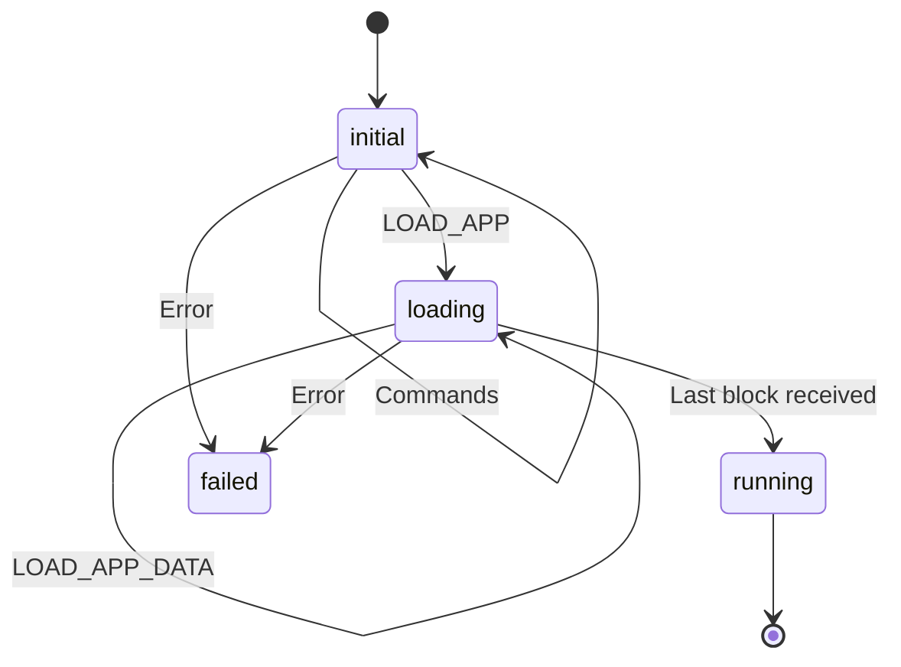

# Firmware implementation notes

## Introduction

This text is specific for the firmware, the piece of software in TKey
ROM. For a more general description on how to implement device apps,
see [the TKey Developer Handbook](https://dev.tillitis.se/).

## Definitions

- Firmware: Software in ROM responsible for loading, measuring, and
  starting applications. The firmware is included as part of the FPGA
  bitstream and not replacable on a usual consumer TKey.
- Client: Software running on a computer or a mobile phone the TKey is
  inserted into.
- Device application or app: Software supplied by the client that runs
  on the TKey.

## CPU modes and firmware

The TKey has two modes of software operation: firmware mode and
application mode. The TKey always starts in firmware mode when it
starts the firmware. When the application starts the hardware
automatically switches to a more constrained environment: the
application mode.

The TKey hardware cores are memory mapped but the memory access is
different depending on mode. Firmware has complete access, except that
the Unique Device Secret (UDS) words are readable only once even in
firmware mode. The memory map is constrained when running in
application mode, e.g. FW\_RAM and UDS isn't readable, and several
other hardware addresses are either not readable or not writable for
the application.

When doing system calls from a device app the context switches back to
firmware mode. However, the UDS is still not available, protected by
two measures: 1) the UDS words can only be read out once and have
already been read by firmware when measuring the app, and, 2) the UDS
is protected by hardware after the execution leaves ROM for the first
time.

See the table in [the Developer
Handbook](https://dev.tillitis.se/memory/) for an overview about the
memory access control.

## Communication

The firmware communicates with the client using the
`UART_{RX,TX}_{STATUS,DATA}` registers. On top of that is uses three
protocols: The USB Mode protocol, the TKey framing protocol, and the
firmware's own protocol.

To communicate between the CPU and the CH552 USB controller it uses an
internal protocol, used only within the TKey, which we call the USB
Mode Protocol. It is used in both directions.

| *Name*   | *Size*    | *Comment*                          |
|----------|-----------|------------------------------------|
| Endpoint | 1B        | Origin or destination USB endpoint |
| Length   | 1B        | Number of bytes following          |
| Payload  | See above | Actual data from or to firmware    |

The different endpoints:

| *Name* | *Value* | *Comment*                                                           |
|--------|---------|---------------------------------------------------------------------|
| CTRL   | 0x20    | A USB HID special debug pipe. Useful for debug prints.              |
| CDC    | 0x40    | USB CDC-ACM, a serial port on the client.                           |
| HID    | 0x80    | A USB HID security token device, useful for FIDO-type applications. |

On top of the USB Mode Protocol is [the TKey Framing
Protocol](https://dev.tillitis.se/protocol/) which is described in the
Developer Handbook.

The firmware uses a protocol on top of this framing layer which is
used to bootstrap an application. All commands are initiated by the
client. All commands receive a reply. See [Firmware
protocol](http://dev.tillitis.se/protocol/#firmware-protocol) in the
Dev Handbook for specific details.

## Memory constraints

| *Name*  | *Size*    | *FW mode* | *App mode* |
|---------|-----------|-----------|------------|
| ROM     | 8 kByte   | r-x       | r          |
| FW\_RAM | 4 kByte*  | rw-       | -          |
| RAM     | 128 kByte | rwx       | rwx        |

* FW\_RAM is divided into the following areas:

- fw stack: 3824 bytes.
- resetinfo: 256 bytes.
- rest is available for .data and .bss.

## Firmware behaviour

The purpose of the firmware is to load, measure, and start an
application received from the client over the USB/UART.

The firmware binary is part of the FPGA bitstream as the initial
values of the Block RAMs used to construct the `FW_ROM`. The `FW_ROM`
start address is located at `0x0000_0000` in the CPU memory map, which
is also the CPU reset vector.

### Firmware state machine

This is the state diagram of the firmware. There are only four states.
Change of state occur when we receive specific I/O or a fatal error
occurs.



States:

- `initial` - At start. Allows the commands `NAME_VERSION`, `GET_UDI`,
  `LOAD_APP`.
- `loading` - Expect application data. Allows only the command
  `LOAD_APP_DATA`.
- `run` - Computes CDI and starts the application. Allows no commands.
- `fail` - Stops waiting for commands, flashes LED forever. Allows no
  commands.

Commands in state `initial`:

| *command*             | *next state* |
|-----------------------|--------------|
| `FW_CMD_NAME_VERSION` | unchanged    |
| `FW_CMD_GET_UDI`      | unchanged    |
| `FW_CMD_LOAD_APP`     | `loading`    |
|                       |              |

Commands in state `loading`:

| *command*              | *next state*                     |
|------------------------|----------------------------------|
| `FW_CMD_LOAD_APP_DATA` | unchanged or `run` on last chunk |

See [Firmware protocol in the Dev
Handbook](http://dev.tillitis.se/protocol/#firmware-protocol) for the
definition of the specific commands and their responses.

State changes from "initial" to "loading" when receiving `LOAD_APP`,
which also sets the size of the number of data blocks to expect. After
that we expect several `LOAD_APP_DATA` commands until the last block
is received, when state is changed to "running".

In "running", the loaded device app is measured, the Compound Device
Identifier (CDI) is computed, we do some cleanup of firmware data
structures, enable the system calls, and finally start the app, which
ends the firmware state machine. Hardware guarantees that we leave
firmware mode automatically when the program counter leaves ROM.

The device app is now running in application mode. We can, however,
return to firmware mode (excepting access to the UDS) by doing system
calls. Note that ROM is still readable, but is now hardware protected
from execution, except through the system call mechanism.

### Golden path

Firmware loads the application at the start of RAM (`0x4000_0000`). It
use a part of the special FW\_RAM for its own stack.

When reset is released, the CPU starts executing the firmware. It
begins in `start.S` by clearing all CPU registers, clears all FW\_RAM,
sets up a stack for itself there, and then jumps to `main()`. Also
included in the assembly part of firmware is an interrupt handler for
the system calls, but the handler is not yet enabled.

Beginning at `main()` it fills the entire RAM with pseudo random data
and setting up the RAM address and data hardware scrambling with
values from the True Random Number Generator (TRNG). It then waits for
data coming in through the UART.

Typical expected use scenario:

  1. The client sends the `FW_CMD_LOAD_APP` command with the size of
     the device app and the optional 32 byte hash of the user-supplied
     secret as arguments and gets a `FW_RSP_LOAD_APP` back. After
     using this it's not possible to restart the loading of an
     application.

  2. If the the client receive a sucessful response, it will send
     multiple `FW_CMD_LOAD_APP_DATA` commands, together containing the
     full application.

  3. On receiving`FW_CMD_LOAD_APP_DATA` commands the firmware places
     the data into `0x4000_0000` and upwards. The firmware replies
     with a `FW_RSP_LOAD_APP_DATA` response to the client for each
     received block except the last data block.

  4. When the final block of the application image is received with a
     `FW_CMD_LOAD_APP_DATA`, the firmware measure the application by
     computing a BLAKE2s digest over the entire application. Then
     firmware send back the `FW_RSP_LOAD_APP_DATA_READY` response
     containing the digest.

  5. The Compound Device Identifier
     ([CDI]((#compound-device-identifier-computation))) is then
     computed by doing a new BLAKE2s using the Unique Device Secret
     (UDS), the application digest, and any User Supplied Secret
     (USS) digest already received.

  6. The start address of the device app, currently `0x4000_0000`, is
     written to `APP_ADDR` and the size of the binary to `APP_SIZE` to
     let the device application know where it is loaded and how large
     it is, if it wants to relocate in RAM.

  7. The firmware now clears the part of the special `FW_RAM` where it
     keeps it stack.

  8. The interrupt handler for system calls is enabled.

  9. Firmware starts the application by jumping to the contents of
     `APP_ADDR`. Hardware automatically switches from firmware mode to
     application mode. In this mode some memory access is restricted,
     e.g. some addresses are inaccessible (`UDS`), and some are
     switched from read/write to read-only (see [the memory
     map](https://dev.tillitis.se/memory/)).

If during this whole time any commands are received which are not
allowed in the current state, or any errors occur, we enter the
"failed" state and execute an illegal instruction. An illegal
instruction traps the CPU and hardware blinks the status LED red until
a power cycle. No further instructions are executed.

### User-supplied Secret (USS)

USS is a 32 bytes long secret provided by the user. Typically a client
program gets a secret from the user and then does a key derivation
function of some sort, for instance a BLAKE2s, to get 32 bytes which
it sends to the firmware to be part of the CDI computation.

### Compound Device Identifier computation

The CDI is computed by:

```
CDI = blake2s(UDS, blake2s(app), USS)
```

In an ideal world, software would never be able to read UDS at all and
we would have a BLAKE2s function in hardware that would be the only
thing able to read the UDS. Unfortunately, we couldn't fit a BLAKE2s
implementation in the FPGA at this time.

The firmware instead does the CDI computation using the special
firmware-only `FW_RAM` which is invisible after switching to app mode.
We keep the entire firmware stack in `FW_RAM` and clear the stack just
before switching to app mode just in case.

We sleep for a random number of cycles before reading out the UDS,
call `blake2s_update()` with it and then immediately call
`blake2s_update()` again with the program digest, destroying the UDS
stored in the internal context buffer. UDS should now not be in
`FW_RAM` anymore. We can read UDS only once per power cycle so UDS
should now not be available even to firmware.

Then we continue with the CDI computation by updating with an optional
USS digest and finalizing the hash, storing the resulting digest in
`CDI`.

### Firmware system calls

The firmware provides a system call mechanism through the use of the
PicoRV32 interrupt handler. They are triggered by writing to the
trigger address: 0xe1000000. It's typically done with a function
signature like this:

```
int syscall(uint32_t number, uint32_t arg1);
```

Arguments are system call number and upto 6 generic arguments passed
to the system call handler. The caller should place the system call
number in the a0 register and the arguments in registers a1 to a7
according to the RISC-V calling convention. The caller is responsible
for saving and restoring registers.

The syscall handler returns execution on the next instruction after
the store instruction to the trigger address. The return value from
the syscall is now available in x10 (a0).

To add or change syscalls, see the `syscall_handler()` in
`syscall_handler.c`.

Currently supported syscalls:

| *Name*      | *Number* | *Argument* | *Description*                    |
|-------------|----------|------------|----------------------------------|
| RESET       | 1        | Unused     | Reset the TKey                   |
| SET\_LED    | 10       | Colour     | Set the colour of the status LED |
| GET\_VIDPID | 12       | Unused     | Get Vendor and Product ID        |

## Developing firmware

Standing in `hw/application_fpga/` you can run `make firmware.elf` to
build just the firmware. You don't need all the FPGA development
tools. See [the Developer Handbook](https://dev.tillitis.se/tools/)
for the tools you need. The easiest is probably to use your OCI image,
`ghcr.io/tillitis/tkey-builder`.

[Our version of qemu](https://dev.tillitis.se/tools/#qemu-emulator) is
also useful for debugging the firmware. You can attach GDB, use
breakpoints, et cetera.

There is a special make target for QEMU: `qemu_firmware.elf`, which
sets `-DQEMU_CONSOLE`, so you can use plain debug prints using the
helper functions in `lib.c` like `htif_puts()` `htif_putinthex()`
`htif_hexdump()` and friends. Note that these functions are only
usable in qemu and that you might need to `make clean` before
building, if you have already built before.

### Test firmware

The test firmware is in `testfw`. It's currently a bit of a hack and
just runs through expected behavior of the hardware cores, giving
special focus to access control in firmware mode and application mode.

It outputs results on the UART. This means that you have to attach a
terminal program to the serial port device, even if it's running in
qemu. It waits for you to type a character before starting the tests.

It needs to be compiled with `-Os` instead of `-O2` in `CFLAGS` in the
ordinary `application_fpga/Makefile` to be able to fit in the 6 kByte
ROM.
