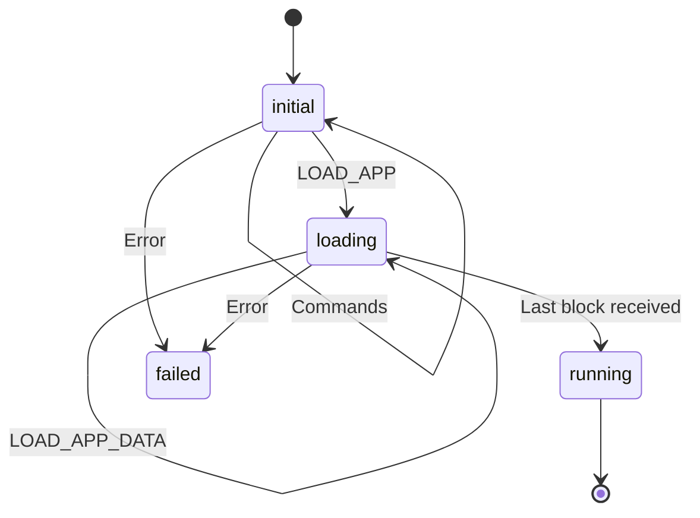

# Firmware

## Introduction

This text is an introduction to, a requirement specification of,
and some implementation notes of the TKey firmware. It also gives a
few hint on developing and debugging the firmware.

This text is specific for the firmware. For a more general description
on how to implement device apps, see [the TKey Developer
Handbook](https://dev.tillitis.se/).

## Definitions

- Firmware - software in ROM responsible for loading applications. The
  firmware is included as part of the FPGA bitstream and not
  replacable on a usual consumer TKey.
- Device application or app - software supplied by the client which is
  received, loaded, measured, and started by the firmware.

## CPU modes and firmware

The TKey has two modes of software operation: firmware mode and
application mode. The TKey always starts in firmware mode and starts
the firmware. When the firmware is about to start the application it
switches to a more constrained environment, the application mode.

The TKey hardware cores are memory mapped. Firmware has complete
access, except that the UDS is readable only once. The memory map is
constrained when running in application mode, e.g. FW\_RAM and UDS
isn't readable, and several other hardware addresses are either not
readable or not writable for the application.

See the table in [the Developer
Handbook](https://dev.tillitis.se/memory/) for an overview about the
memory access control.

## Communication

The firmware communicates with the client using the
`UART_{RX,TX}_{STATUS,DATA}` registers. On top of that is uses three
protocols: The USB Mode protocol, the TKey framing protocol, and the
firmware's own protocol.

To communicate between the CPU and the CH552 USB controller it uses an
internal protocol, used only within the TKey, which we call the USB
Mode Protocol. It is used in both directions.

| *Name*   | *Size*    | *Comment*                          |
|----------|-----------|------------------------------------|
| Endpoint | 1B        | Origin or destination USB endpoint |
| Length   | 1B        | Number of bytes following          |
| Payload  | See above | Actual data from or to firmware    |

The different endpoints:

| *Name* | *Value* | *Comment*                                                           |
|--------|---------|---------------------------------------------------------------------|
| CTRL   | 0x20    | A USB HID special debug pipe. Useful for debug prints.              |
| CDC    | 0x40    | USB CDC-ACM, a serial port on the client.                           |
| HID    | 0x80    | A USB HID security token device, useful for FIDO-type applications. |

On top of the USB Mode Protocol is [the TKey Framing
Protocol](https://dev.tillitis.se/protocol/) which is described in the
Developer Handbook.

The firmware uses a protocol on top of this framing layer which is
used to bootstrap an application. All commands are initiated by the
client. All commands receive a reply. See [Firmware
protocol](http://dev.tillitis.se/protocol/#firmware-protocol) in the
Dev Handbook for specific details.

## Memory constraints

- ROM: 6 kByte.
- FW\_RAM: 4 kByte.
  - fw stack: 3824 bytes.
  - resetinfo: 272 bytes.
- RAM: 128 kByte.

## Firmware behaviour

The purpose of the firmware is to load, measure, and start an
application received from the client over the USB/UART.

The firmware binary is part of the FPGA bitstream as the initial
values of the Block RAMs used to construct the `FW_ROM`. The `FW_ROM`
start address is located at `0x0000_0000` in the CPU memory map, which
is the CPU reset vector.

### Firmware state machine

This is the state diagram of the firmware. There are only four states.
Change of state occur when we receive specific I/O or a fatal error
occurs.



States:

- `initial` - At start. Allows the commands `NAME_VERSION`, `GET_UDI`,
  `LOAD_APP`.
- `loading` - Expect application data. Allows only the command
  `LOAD_APP_DATA`.
- `run` - Computes CDI and starts the application. Allows no commands.
- `fail` - Stops waiting for commands, flashes LED forever. Allows no
  commands.

Commands in state `initial`:

| *command*             | *next state* |
|-----------------------|--------------|
| `FW_CMD_NAME_VERSION` | unchanged    |
| `FW_CMD_GET_UDI`      | unchanged    |
| `FW_CMD_LOAD_APP`     | `loading`    |
|                       |              |

Commands in state `loading`:

| *command*              | *next state*                     |
|------------------------|----------------------------------|
| `FW_CMD_LOAD_APP_DATA` | unchanged or `run` on last chunk |

See [Firmware protocol in the Dev
Handbook](http://dev.tillitis.se/protocol/#firmware-protocol) for the
definition of the specific commands and their responses.

State changes from "initial" to "loading" when receiving `LOAD_APP`,
which also sets the size of the number of data blocks to expect. After
that we expect several `LOAD_APP_DATA` commands until the last block
is received, when state is changed to "running".

In "running", the loaded device app is measured, the Compound Device
Identifier (CDI) is computed, we do some cleanup of firmware data
structures, flip to application mode, and finally start the app, which
ends the firmware state machine.

The device app is now running in application mode. There is no other
means of getting back from application mode to firmware mode than
resetting/power cycling the device. Note that ROM is still accessible
in the memory map, so it's still possible to execute firmware code in
application mode, but with no privileged access.

Firmware loads the application at the start of RAM (`0x4000_0000`). It
use a part of the special FW\_RAM for its own stack.

When reset is released, the CPU starts executing the firmware. It
begins by clearing all CPU registers, clears all FW\_RAM, sets up a
stack for itself there, and then jumps to `main()`.

Beginning at `main()` it sets up the "system calls", then fills the
entire RAM with pseudo random data and setting up the RAM address and
data hardware scrambling with values from the True Random Number
Generator (TRNG). It then waits for data coming in through the UART.

Typical expected use scenario:

  1. The client sends the `FW_CMD_LOAD_APP` command with the size of
     the device app and the optional 32 byte hash of the user-supplied
     secret as arguments and gets a `FW_RSP_LOAD_APP` back. After
     using this it's not possible to restart the loading of an
     application.

  2. If the the client receive a sucessful response, it will send
     multiple `FW_CMD_LOAD_APP_DATA` commands, together containing the
     full application.

  3. On receiving`FW_CMD_LOAD_APP_DATA` commands the firmware places
     the data into `0x4000_0000` and upwards. The firmware replies
     with a `FW_RSP_LOAD_APP_DATA` response to the client for each
     received block except the last data block.

  4. When the final block of the application image is received with a
     `FW_CMD_LOAD_APP_DATA`, the firmware measure the application by
     computing a BLAKE2s digest over the entire application. Then
     firmware send back the `FW_RSP_LOAD_APP_DATA_READY` response
     containing the digest.

  5. The Compound Device Identifier
     ([CDI]((#compound-device-identifier-computation))) is then
     computed by doing a new BLAKE2s using the Unique Device Secret
     (UDS), the application digest, and any User Supplied Secret
     (USS).

  6. The start address of the device app, currently `0x4000_0000`, is
     written to `APP_ADDR` and the size of the binary to `APP_SIZE` to
     let the device application know where it is loaded and how large
     it is, if it wants to relocate in RAM.

  7. The firmware now clears the part of the special `FW_RAM` where it
     keeps it stack. After this it performs no more function calls and
     uses no more automatic variables.

  8. Firmware starts the application by first switching from firmware
     mode to application mode by writing to the `SYSTEM_MODE_CTRL`
     register. In this mode the MMIO region is restricted, e.g. some
     registers are removed (`UDS`), and some are switched from
     read/write to read-only (see [the memory
     map](https://dev.tillitis.se/memory/)).

     Then the firmware jumps to what is in `APP_ADDR` which starts the
     application.

If during this whole time any commands are received which are not
allowed in the current state, we enter the "failed" state and execute
an illegal instruction. An illegal instruction traps the CPU and
hardware blinks the status LED red until a power cycle. No further
instructions are executed.

### User-supplied Secret (USS)

USS is a 32 bytes long secret provided by the user. Typically a client
program gets a secret from the user and then does a key derivation
function of some sort, for instance a BLAKE2s, to get 32 bytes which
it sends to the firmware to be part of the CDI computation.

### Compound Device Identifier computation

The CDI is computed by:

```
CDI = blake2s(UDS, blake2s(app), USS)
```

In an ideal world, software would never be able to read UDS at all and
we would have a BLAKE2s function in hardware that would be the only
thing able to read the UDS. Unfortunately, we couldn't fit a BLAKE2s
implementation in the FPGA at this time.

The firmware instead does the CDI computation using the special
firmware-only `FW_RAM` which is invisible after switching to app mode.
We keep the entire firmware stack in `FW_RAM` and clear the stack just
before switching to app mode just in case.

We sleep for a random number of cycles before reading out the UDS,
call `blake2s_update()` with it and then immediately call
`blake2s_update()` again with the program digest, destroying the UDS
stored in the internal context buffer. UDS should now not be in
`FW_RAM` anymore. We can read UDS only once per power cycle so UDS
should now not be available to firmware at all.

Then we continue with the CDI computation by updating with an optional
USS and then finalizing the hash, storing the resulting digest in
`CDI`.

### Firmware services

The firmware exposes a BLAKE2s function through a function pointer
located in MMIO `BLAKE2S` (see [memory
map](system_description.md#memory-mapped-hardware-functions)) with the
with function signature:

```c
int blake2s(void *out, unsigned long outlen, const void *key,
	    unsigned long keylen, const void *in, unsigned long inlen,
	    blake2s_ctx *ctx);

```

where `blake2s_ctx` is:

```c
typedef struct {
	uint8_t b[64]; // input buffer
	uint32_t h[8]; // chained state
	uint32_t t[2]; // total number of bytes
	size_t c;      // pointer for b[]
	size_t outlen; // digest size
} blake2s_ctx;
```

The `libcommon` library in
[tkey-libs](https://github.com/tillitis/tkey-libs/)
has a wrapper for using this function called `blake2s()` which needs
to be maintained if you do any changes to the firmware call.

## Developing firmware

Standing in `hw/application_fpga/` you can run `make firmware.elf` to
build just the firmware. You don't need all the FPGA development
tools. See [the Developer Handbook](https://dev.tillitis.se/tools/)
for the tools you need. The easiest is probably to use your OCI image,
`ghcr.io/tillitis/tkey-builder`.

[Our version of qemu](https://dev.tillitis.se/tools/#qemu-emulator) is
also useful for debugging the firmware. You can attach GDB, use
breakpoints, et cetera.

There is a special make target for QEMU: `qemu_firmware.elf`, which
sets `-DQEMU_CONSOLE`, so you can use plain debug prints using the
helper functions in `lib.c` like `htif_puts()` `htif_putinthex()`
`htif_hexdump()` and friends. Note that these functions are only
usable in qemu and that you might need to `make clean` before
building, if you have already built before.

### Test firmware

The test firmware is in `testfw`. It's currently a bit of a hack and
just runs through expected behavior of the hardware cores, giving
special focus to access control in firmware mode and application mode.

It outputs results on the UART. This means that you have to attach a
terminal program to the serial port device, even if it's running in
qemu. It waits for you to type a character before starting the tests.

It needs to be compiled with `-Os` instead of `-O2` in `CFLAGS` in the
ordinary `application_fpga/Makefile` to be able to fit in the 6 kByte
ROM.
