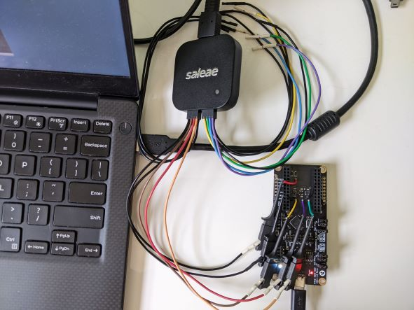
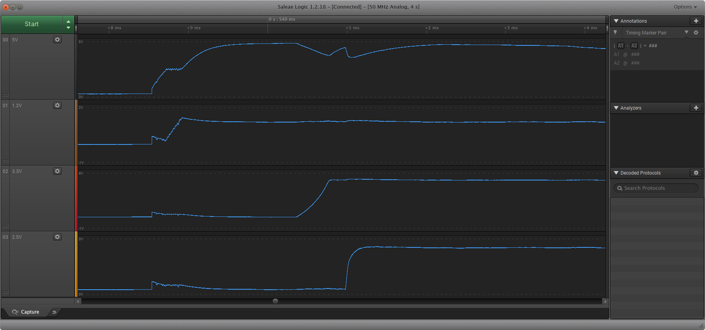
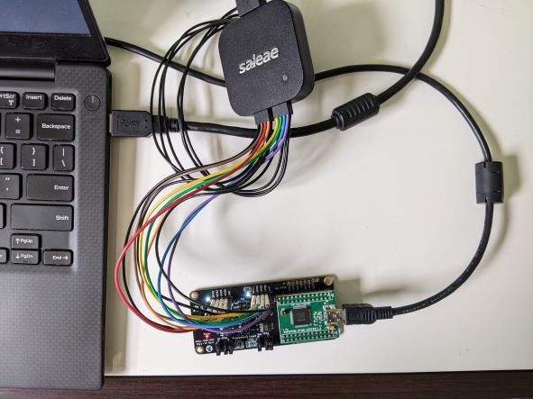
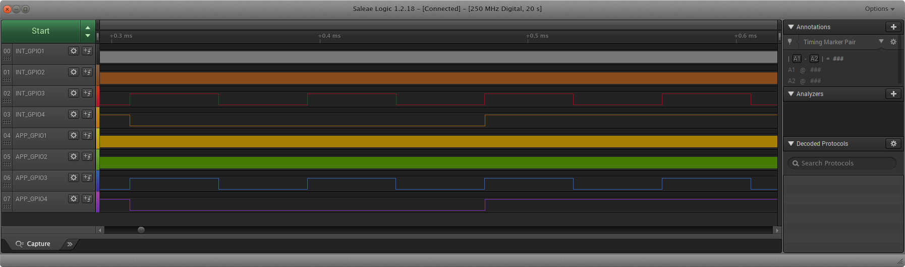
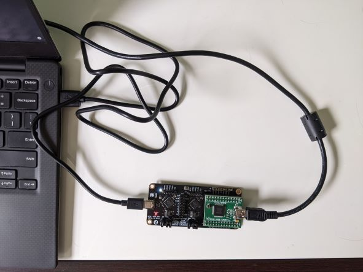

# MTA1-USB-DEV hardware test

This is a collection of hardware bringup tests for the MTA1-USB-DEV board. The goal is to verify that the board has been manufactured correctly.

## Power tests

### Voltage rails

The MTA1-USB-DEV board has three voltage supplies- 1.2V, 3.3V, and 2.5V. These are measured by hand using a sufficiently accurate DMM. Additionally, the power supplies must come up in a specific sequence (see the notes on schematic page 2). This can be verified using an oscilloscope. No specific program is required to be loaded on the FPGAs.

Instructions for testing power-on sequence (note: similar procedure applies for testing with logic analyzer):

1. Remove the FTDI programming daughterboard from the MTA1-USB-DEV board
2. Attach test leads to the 1.2V, 2.5V, 3.3V, and 5V input test pads on the dev board, and to ground points physically near these test points.
3. Connect oscilloscope probe leads to each of these connections. Alternatively, a logic analyzer with analog function can be used for this purpose.
4. Configure the vertical scale of each input to 0.5V/division. Configure the horizontal scale to ?ms/division.
5. Configure the trigger to use the 5V channel as an input, and to a positive-edge trigger, with the reference set to 0.5V.
6. Configure the acquisition mode to 'normal'
7. Apply power to the board using a USB C cable.
8. The full power-on sequence should be captured by the oscilloscope. Verify that it meets the timing requirements detailed in the schematic.

Instructions for testing the accuracies of each voltage supply:

1. Remove the FTDI programming daughterboard from the MTA1-USB-DEV board
2. Apply power to the board using a USB C cable.
3. Use a sufficiently accurate DMM to measure the voltage of the 1.2V, 2.5V, and 3.3V rails, at their test points.

TODO: Set specs for this.

### Inrush current (optional)

The inrush current for USB is limited to < xxx mA. Use a current probe to check that the inrush current is lower than the spec.

## GPIO test

This test verifies that all digital lines on the board are connected correctly. To achieve this, unique signals are routed through each connection on each FPGA, and their outputs are measured manually using a logic analyzer or oscilloscope. This is intended to lay the basis for an automated production test.

Instructions:

1. Attach the FTDI programming daughterboard to the MTA1-USB-DEV board.
2. Set the programming jumpers for both the interface and application FPGAs to the 'flash' setting.
3. Attach a logic analyzer to GPIO1-4 on both the interface and application fpgas.
4. Connect the FTDI board to a computer using a USB A to USB mini cable. Do not connect anything to the USB C port on the MTA1-USB-DEV board.
5. Run the included script 'gpio_test.sh' to automatically build the test gateware, and to load it into the flash memories for each FPGA.
5. Verify that the LEDs are blinking, and that all colors (R, G, and B) are visible.
6. Press the user button on the application FPGA. Verify that the appliction LED turns off.
7. Release the user button the application FPGA. Verify that the application LED turns back on.
8. Configure the logic analyzer to read all GPIO channels. Verifiy that each GPIO is outputting square waves at different frequencies:

Explanations of how each subcircuit are covered by this test follow.

### Interface and Application FPGA programming connections

This inclues '_ICE_MISO, _ICE_MOSI, _ICE_SCK, _ICE_SS, _CRESET, _CDONE'. These nets are tested by using the FTDI chip to program the FPGAs in 'live' mode. All nets need to be connected correctly to their respective FPGA for the programming to succeed.

Next, the programming jumpers must be configured to target flash, and the FTDI chip is then used program the SPI flashes. If the FPGAs boot, then it is assumed that the nets are also connected to the SPI flashes.

### Interface FPGA to App FPGA connections

This includes nets 'MISO, SCK, MOSI, SS', as well as EXTRA1-EXTRA10. These pins are tested by passing a single clock signal back and forth between the two FPGAs. The clock signal is first output from the interface FPGA on the HOST_SS net. It is then used as a clock input on the application FGPA, where it is divided by two, then output by the application FPGA on the HOST_SCK net. This strategy continues until all pins are used. All connections can then be verified at once by looking at the clock frequency of the final net, HOST_EXTRA10. This should be ~2.93KHz.

### GPIO connections

Both the interface and application FPGAs have '_GPIO1, _GPIO2, _GPIO3, _GPIO4' expansion connections. These are tested by outputting different frequency clocks to them, which are manually verified using a logic analyzer or oscilloscope.

### RGB LEDs

Both the interface and application FPGAs have RGB status LEDs. These are verified by feeding different clock signals into each color channel, so that the LEDs will rapidly cycle through many output colors. The LED connections can then be verified by looking at them.

### Interface FPGA 48MHz clock

The external clock that is connected to the interface FPGA has a test pad that can be used by a high precision counter to measure both frequency and clock stability. For the initial bringup test, only the frequency is measured.

### Application FPGA user button

The user button is used to gate the output of the application FPGA LED. The button is considered connected if it turns off the application FPGA LED when it is pressed.

## USB test

The USB connection on the interface FPGA is verified by loading a USB-capable bitstream onto the interface FPGA, and verifying that a Linux-based host is able to see the device.

Instructions:

1. Attach the FTDI programming daughterboard to the MTA1-USB-DEV board.
2. Set the programming jumpers for both the interface and application FPGAs to the 'flash' setting.
3. Connect the FTDI board to a computer (running Linux) using a USB A to USB mini cable.
4. Connect the USB C port to the computer using a USB A to USB C cable.
5. Run the included script 'usb_test.sh'. The script will load a USB bitstream into the application FPGA
6. After a short delay, the script will test if the USB device has attached to the computer, and print the test result.

